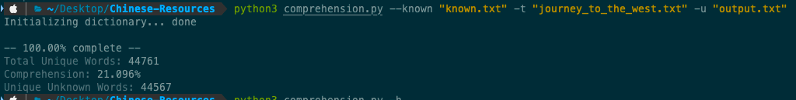

# chinese-comprehension
Analyze a Chinese text using your known words to gauge comprehension.


## Features
- Count unique words in text
  - Count unique unknown words in text
- Calculate comprehension of text based on your known words
  - Calculate the above splitting text and known vocab word-by-word or character-by-character
- Output unknown words into a file

## Usage
```
usage: comprehension.py [-h] -k KNOWN -t TARGET [-m MODE] [-u UNKNOWN]

Calculates percentage comprehension of a text file based on known words.

optional arguments:
  -h, --help            show this help message and exit
  -k KNOWN, --known KNOWN
                        Relative path to .txt file with newline-separated known words.
  -t TARGET, --target TARGET
                        Relative path to .txt target file in Chinese.
  -m MODE, --mode MODE  Mode for separating text and known vocab: 'smart' (default, word-by-word using jieba) 'simple' (character-by-character)
  -u UNKNOWN, --unknown UNKNOWN
                        Path to output file with unknown words from text. Skip to not create an output file.
```

The `--known` parameter takes the filename containing known words. These words represent all words the user knows for best accuracy. Methods for fetching these words:
- export from Anki
- export from Pleco
- take HSK test
- consult [HelloChinese word list](https://docs.google.com/spreadsheets/d/1PppWybtv_ch5QMqtWlU4kAm08uFuhYK-6HGVnGeT63Y/edit#gid=121546596)

The file should have words separated line-by-line:
```
是
你好
再见
有
五
...
```

The `--target` paramaeter takes the filename containing the target text. This should be normally formatted:
```
美猴王一見，倒身下拜，磕頭不計其數，口中只道：「師父，師父，我弟子志心
朝禮，志心朝禮。」祖師道：「你是那方人氏？且說個鄉貫、姓名明白，再拜。」
猴王道：「弟子乃東勝神洲傲來國花果山水簾洞人氏。」祖師喝令：「趕出去！
他本是個撒詐搗虛之徒，那裏
...
```

### Example

*Code*: `python3 comprehension.py --known "known.txt" -t "journey_to_the_west.txt" -u "output.txt"`
*Description*: Gathers known words from `known.txt`, and analyzes `journey_to_the_west.txt` using the default word-by-word splitting. Unknown words are outputted to `output.txt`.

*Content of `output.txt`*
```
道 : 4621
行者 : 2575
來 : 1665
裏 : 1591
與 : 1498
又 : 1485
卻 : 1264
...
```

# Analyzer

## Usage
```
usage: analyzer.py [-h] -t TARGET [-o OUTPUT]

Calculate unique words and character count of a text file - result is rounded to nearest 50

optional arguments:
  -h, --help            show this help message and exit
  -t TARGET, --target TARGET
                        Relative path to .txt target file in Chinese.
  -o OUTPUT, --output OUTPUT
                        Path to output file with all words & characters words from text. Skip to
                        not create an output file.
```

### Example

*Code*: `python3 analyzer.py -t "journey_to_the_west.txt" -o "output.txt"`
*Description*: Analyzes `journey_to_the_west.txt` using the word-by-word and character-by-character splitting. Outputs all characters and words to `output.txt`.

*Output*
```
Total Unique Words: 32226
Total Unique Characters: 3572
```

*Content of `output.txt`*
```
=== All Unique Words ===
的 : 18840
了 : 15791
昇 : 10683
周 : 9155
余皓 : 8995
我 : 7512
...

=== All Unique Characters ===
的 : 19664
了 : 17135
余 : 14223
皓 : 14103
一 : 12667
周 : 11641
昇 : 10756
不 : 10217
我 : 8723
```
